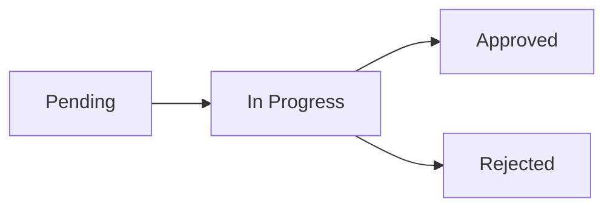

# Citizen Report App (Desa-Kita)


Aplikasi web untuk pelaporan warga yang dibuat dengan tujuan sederhana: membuat sistem RT/RW yang biasanya ribet jadi lebih rapi, cepat, dan bisa dilacak.

---

## Latar Belakang & Solusi

### Masalah yang Sering Terjadi
Di banyak lingkungan RT/RW, pelaporan masih pakai cara lama:
- Kertas (yang gampang hilang atau numpuk)
- Chat grup (yang tenggelam di antara pesan lain)
- Atau Laporan secara langsung

Akhirnya:
- Laporan sering terlewat
- Status nggak jelas
- Pengurus juga bingung tracking mana yang sudah ditangani

### Solusi yang Dibuat
**Desa-Kita** hadir sebagai platform terpusat.

Warga bisa:
- Kirim laporan langsung (real-time)
- Lihat status laporan
- Dapat pengumuman resmi tanpa harus scroll chat panjang

Di sisi lain, pengurus bisa:
- Mengelola laporan lebih terstruktur
- Memantau progress tanpa ribet

Intinya, lebih transparan dan tidak membuang waktu.

---

## Installation

Clone repository:

```bash
git clone https://github.com/Xhyro-v/Desa-Kita.git
```

Install dependencies:

```bash
pip install -r requirements.txt
```

Run server:

```bash
uvicorn main:app --reload
```
or
```bash
python -m uvicorn main:app --reload
```

---

## Demo Aplikasi

### Screenshot Tampilan

- UI User/Warga

| Halaman Warga (1/2) | Halaman Warga(2/2) |
| :--- | :--- |
|  |  |

- UI Pelaporan User/Warga

| Laporan | Inpeksi Laporan | Status Laporan |
| :--- | :--- | :--- |
|  |  |  |

- UI Admin/Moderator

| Pengumuman | Inpeksi Laporan | Status Laporan |
| :--- | :--- | :--- |
|  |  |  |

### Video Pemakaian
Berisi cara penggunaan dari sisi warga dan admin.

[► Tonton Video Demo Pemakaian](Link_Video_YouTube_Atau_Drive_Lu_Di_Sini)

---

## Alur Status Laporan



---

## Fitur Utama

- Sistem autentikasi dengan role (Warga & Admin)
- Dashboard khusus admin untuk monitoring
- Sistem pengumuman terpusat
- Manajemen laporan dengan halaman detail
- Status laporan yang berubah secara dinamis
- Tampilan responsive (HP dan desktop masih enak dipakai)

---

